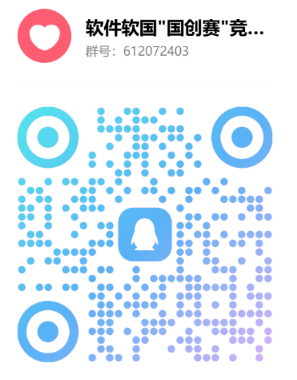
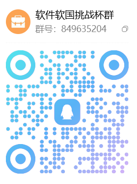
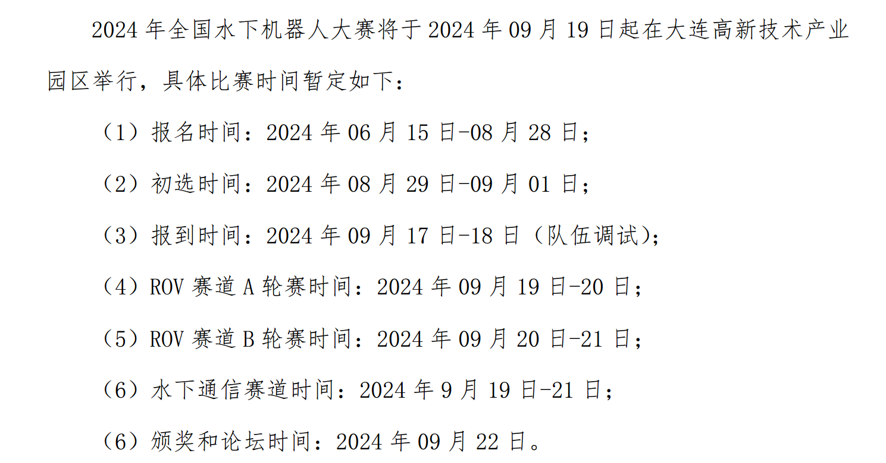
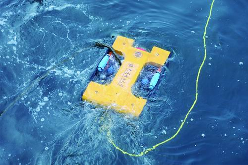
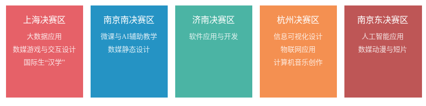

# 中国国际大学生创新大赛

中国国际大学生创新大赛是一项面向全球高校学生的高水平创新创业赛事，旨在激发青年学生的创新活力，促进科技成果加速转化，推动教育链、人才链与产业链、创新链的深度融合。大赛通过多赛道融合、多环节选拔，为青年人才展示创意、验证技术、连接产业资源提供重要平台。参赛团队由学生自主组成，人数不少于 3 人且不超过 15 人，并可邀请不超过 15 名指导教师共同参与项目培育与竞赛辅导。

### 加分政策

作为学校认定的国家级重点赛事，创新大赛属于一级竞赛类别。根据学校政策，参赛学生在相关认定中可额外获得 10 分加分奖励，具有较高的竞争价值与实践意义。

### 比赛官网链接

https://cy.ncss.cn/

### 校区比赛通知 QQ 群

### 比赛赛程规划

以下时间表供参考（会根据省赛、国赛赛程安排实时调整）

| 时间                    | 赛事安排（预估）                                                                                                                                                                                                                    |
| ----------------------- | ----------------------------------------------------------------------------------------------------------------------------------------------------------------------------------------------------------------------------------- |
| 5 月                    | 大赛启动仪式                                                                                                                                                                                                                        |
| 5 月至 6 月             | 1. 辅导讲座 1：赛道分析与评审要点（待定） 2. 辅导讲座 2：校内选拔赛说明与网评材料制作（待定） 3. 辅导讲座 3：商业计划书撰写与商业常识（待定） 4. 辅导讲座 4：知识产权准备（待定） 5. 辅导讲座：产业命题赛道专题（待定） |
| 5 月 19 日至 5 月 31 日 | 正式报名（所有参赛项目在大创网系统中报名，产业赛道另行安排）                                                                                                                                                                        |
| 6 月 1 日               | 开始组织校内选拔赛                                                                                                                                                                                                                  |
| 6 月上中旬              | 校赛网评、校赛训练营、校赛决赛                                                                                                                                                                                                      |
| 6 月中下旬              | 省赛网评                                                                                                                                                                                                                            |
| 7 月上旬                | 省赛决赛                                                                                                                                                                                                                            |
| 8 月中下旬              | 国赛网评                                                                                                                                                                                                                            |
| 9 月下旬                | 全国总决赛                                                                                                                                                                                                                          |

# “ 挑战杯” 全国大学生课外学术科技作品竞赛

“挑战杯”全国大学生课外学术科技作品竞赛是由共青团中央、中国科协、教育部、中国社会科学院、全国学联和地方政府共同主办，国内著名大学、新闻媒体联合发起的一项具有导向性、示范性和群众性的全国竞赛活动。分为三个赛道“挑战杯”主体赛，“揭榜挂帅”擂台赛，“人工智能+”专项赛。

### 加分政策

属于学校认定的国家级重点赛事，属于一级竞赛类别。根据学校政策，参赛学生在相关认定中可额外获得 10 分加分奖励，具有较高的竞争价值与实践意义。

### 比赛官网

https://www.tiaozhanbei.net/

### 软件软国挑战杯 QQ 群

## “挑战杯”主体赛

经大连理工大学“攀登杯”竞赛选拔后参赛，具体时间安排参考大连理工大学“攀登杯”

## “揭榜挂帅”擂台赛

“揭榜挂帅”擂台赛旨在深入学习贯彻习近平新时代中国特色社会主义思想，全面落实党的二十大以及二十届二中、三中全会精神，贯彻习近平总书记关于科技创新的重要论述，教育引导广大青年面向国家重大战略需求，积极投身科研攻关与技术突破，为加快科技成果向现实生产力转化贡献青春力量，奋力书写在中国式现代化进程中挺膺担当的时代篇章。

赛事采用企业“发榜”、高校与青年人才“揭榜”的组织模式。来自全国各行业领域的企业和科研机构面向实际生产与技术发展的关键难题发布榜题，邀请全国高校学生及青年科技人才团队以科研攻关形式应榜作答，解决真实问题，通过“揭榜破题”评选出最终擂主。“揭榜挂帅”擂台赛设学生赛道与青年科技人才赛道，面向不同阶段的青年群体提供多层次创新挑战平台。

### 赛程安排

以下时间仅供参考

- 揭榜报名时间： 5 月 30 日—6 月 30 日

- 攻关打擂时间： 6 月—8 月（团队根据榜题要求集中开展科研攻关，具体提交时间以各发榜单位要求为准）

- 组委会初审时间： 8 月底至 9 月中旬

- 终审擂台赛时间： 9 月底至 10 月中旬

### 往届参赛要求参考通知（2025）

https://ss.dlut.edu.cn/info/1371/26741.htm

https://mp.weixin.qq.com/s/P-fwxaD6ea0QROBWFqtkQw

## “人工智能+”专项赛

为贯彻党的二十大精神，推动人工智能与经济社会深度融合，培养兼具 AI 技术与行业理解的复合型人才，第十九届“挑战杯”特设“人工智能+”专项赛，鼓励青年以创新实践助力新质生产力发展。

### 赛程安排参考

省赛组委会组织评审环节，并于 7 月 31 日前完成“人工智能+”创意赛、应用赛的国赛推报工作，不限名额择优推报，国赛按照学历最高的参赛成员划分至专科组、本科组、硕士组和博士组分开评审。“人工智能+”挑战赛根据各题目要求提交作品。9 月上旬前，组织国赛初审。终审决赛与主体赛全国终审决赛一并开展评审。

### 往届参赛要求参考通知（2025）

https://ss.dlut.edu.cn/info/1371/26741.htm

https://mp.weixin.qq.com/s/zw7agyD6BtsiHD3kzEDlQg

# “ 挑战杯” 中国大学生创业计划大赛

经大连理工大学“攀登杯”竞赛选拔后参赛，具体时间安排参考大连理工大学“攀登杯”

# ACM-ICPC 国际大学生程序设计竞赛

### 赛事简介

ICPC 国际大学生程序设计竞赛，其前身是由国际计算机学会（ACM）主办的 ACM-ICPC 竞赛，竞赛的历史可以上溯到1970年，至今已成功举办 50 届（截止2025年12月）。大赛对参赛学生的逻辑分析能力、策略制定和脑力方面具有极大的挑战性。每年的 ICPC 赛事都会吸引全世界 2000 多所高校的数以万计的队伍参赛，已经发展成为全球范围内最具影响力的大学生计算机竞赛。在过去几十年中，APPLE、AT&T、MICROSOFT、IBM、GOOGLE、JetBrain、华为等企业先后担任了 ICPC 竞赛的全球或洲际赞助商，而历届竞赛中的佼佼者也大多任职于这些世界顶级的科技公司。

ICPC 竞赛由各大洲区域赛（Regionals）和世界决赛（World Finals）两个主要阶段组成。根据各大洲规则，每个区域赛赛站的前若干名学校获得参加世界决赛的资格，世界决赛一般安排在每年的4-5月举行，而区域赛一般安排在上一年的 9 - 12 月举行。一个大学可以有多支队伍参加区域赛，但每年至多只能有一支队伍参加世界决赛。

ICPC 以团队的形式代表各学校参赛，每队最多由 3 名队员组成，队员必须是大学在校生，高中毕业超过五年的学生不符合参赛队员的资格，每名学生至多可以参加 2 次世界决赛。比赛期间，每支参赛队伍使用 1 台计算机在 5 个小时时间内现场编写程序解决 10 - 15 个问题，程序完成之后当场提交评测机运行，运行的结果会判定为“AC（正确）/WA（错误）/TLE（时间超限）/MLE（内存超限）/RE（运行错误）/PE（格式错误）”中的一种并及时通知参赛队伍。每队在正确完成一题后，组织者将在其位置上升起一只代表该题颜色的气球。每道题用时是从竞赛开始到试题解答被判定为正确位置，期间每一次不正确的代码提交都将被罚时20分钟，未正确解答的题目不计时间。最后参赛队伍将按照正确解答题目最多，相同解题数则按照总用时最少的顺序排名，并根据名次颁发奖项。

### 比赛时间

每年 9 月进行网络预选赛，学校队伍数不限，决出各个学校在 6 个赛站的名额分配情况。每个学校在每个赛站最多分配 4 支队伍名额。

6 场区域赛分别在中国的 6 座城市的某所大学举办，时间覆盖 10 - 12 月，从第一个赛站到最后一个赛站，共连续举办六周。每场比赛赛程安排一般为周六签到、热身赛，周日正式比赛、颁奖。

### 官网链接

https://icpc.pku.edu.cn/ (东亚赛区官网)

https://icpc.global/ (ICPC总部官网)

### 参赛要求

需要拥有一定的算法知识积累，经学校内部选拔分配名额（学校每年区域赛各赛站总名额数大概为 10 - 13 个）。每人每赛季限制参加最多 2 场区域赛（官方要求）。

### 赛事难度

竞争激烈，难度较大，同时含金量极高。

建议持续学习 1 ~ 2 年后参加。

### 技术关键字

基础算法、模拟、图论、数据结构、动态规划、贪心、搜索、数学、思维

### 往届情况

中国属于东亚赛区；每个赛季（每年）总共 6 个赛站；每个赛站有来自各个学校的正式参赛队伍 320 - 450 支。金银铜奖获奖比例为 10%，20%，30%。

2025 年大连理工大学开发区校区在网络赛中获得 7 个参赛名额，区域赛共获 1 金奖、2 银奖、2 铜奖。

### 适合人群

- 热爱算法竞赛
- 有较强的自主学习能力
- 有较强的抗压能力
- 能承受持续的高强度学习

### 考点基本相同的其他同类型比赛

- CCF CSP认证
- 中国高校计算机大赛系列大赛 -- 团体程序设计天梯赛
- 蓝桥杯全国大学生软件和信息技术大赛 -- 软件赛
- 百度之星程序设计大赛
- 辽宁省大学生程序设计竞赛

### 加分政策

属于学校认定的国家级重点赛事，属于二级竞赛类别。根据学校政策，参赛学生在相关认定中可额外获得 5 分加分奖励。各个区域赛属于不同比赛，可以重复加分。

### 校区相关组织：CPC 组

# 全国大学生数学建模竞赛

## 比赛简介
全国大学生数学建模竞赛是由教育部高等教育司和中国工业与应用数学学会共同主办的全国性学科竞赛，创办于1992年。竞赛以团队形式开展，旨在培养大学生运用数学理论和方法解决实际问题的能力，提升团队协作、逻辑分析与论文撰写水平，是目前国内规模最大、参与度最高、影响力最广的数学建模类竞赛。

## 国赛关键时间节点
- 竞赛论文提交（全国赛参赛材料提交）：每年9月中下旬（72小时竞赛周期结束当日，统一提交至全国竞赛组委会）
- 全国赛通讯评审：每年11月上旬-中旬（组织全国范围内的专家团队进行匿名评审）
- 全国赛集中复核/答辩（部分重点论文）：每年11月下旬-12月上旬（对高争议性论文或重点推荐论文进行集中复核）
- 全国赛结果公示：次年1-2月（公示全国一、二等奖获奖名单，公示期结束后发布正式获奖公告）
- 获奖证书发放：次年3-4月（由全国竞赛组委会统一印发并分发至获奖队伍）
 
## 官网链接
http://www.mcm.edu.cn/

## 参赛门槛
1. 参赛主体：全日制普通高等院校本科、专科在校大学生（无专业限制）；
2. 组队要求：每支参赛队伍由3名学生组成，可跨专业、跨年级组队；
3. 指导教师：可配备1名指导教师（非强制要求）；
4. 其他：无需前置竞赛成绩，无报名费用。

## 技术关键字（Tag）
数学建模、数据分析、算法设计、编程实现（Python/Matlab/R）、论文撰写、实际问题建模、团队协作

## 全国赛历届情况
1.  发展历程：全国赛始于1992年，首届仅有124所高校314支队伍参赛；截至2024年，已覆盖全国34个省、自治区、直辖市及澳门特别行政区的千余所高校，参赛队伍突破5万支，成为全球规模最大的数学建模竞赛之一；
2.  命题特点：全国赛题目每年更新3-4道（分本科组、专科组），均来自实际行业需求或社会热点问题；
3.  获奖规模：全国赛获奖率严格控制在参赛队伍总数的0.8%-1%（2024年全国一等奖约300项、全国二等奖约700项），获奖队伍均为全国建模能力顶尖的团队；

## 适合人群
1. 对数学建模、数据分析、编程解决实际问题感兴趣的大学生；
2. 希望提升团队协作、逻辑推理、论文写作能力的学生；
3. 理工科、经管类、人文社科类等各专业学生（无专业壁垒，跨专业组队更具优势）；

# ACM 国际大学生程序设计竞赛全球总决赛

每个学校限制一支队伍参加，参赛队伍从 ICPC 国际大学生程序设计竞赛区域赛中选拔产生，选拔细则见官网(https://icpc.pku.edu.cn/)。

截至 2025 年 12 月，大连理工大学没有任何一支队伍入选过全球总决赛。

# 中国机器人大赛暨 RoboCup 机器人世界杯中国赛

> [!NOTE]
> 应区分 RoboMatser 与其的区别，他们是两个完全不同的比赛

### 赛事简介

中国机器人大赛（China Robot Competition，CRC）始于 1999 年，是国内影响力大、综合技术水平高的机器人学科竞赛品牌之一；赛事与 RoboCup 中国公开赛长期联动，覆盖教育科研与产业应用多个方向。赛事通常由中国自动化学会等单位主办，采用“赛区选拔 + 全国总决赛”的办赛模式，强调机器人系统设计、感知与控制、任务执行与对抗协作等综合能力。

### 官网链接

- https://www.bing.com/ck/a?!&&p=928f0873fc5bace928a12a43fd04aeeeca388c2e91387f24ef66ae3a45ce61acJmltdHM9MTc2NjEwMjQwMA&ptn=3&ver=2&hsh=4&fclid=27768eda-ecc4-61d4-3687-981ded1d6070&psq=rebocup&u=a1aHR0cDovL3JvYm9jdXAuZHJjdC1jYWEub3JnLmNuL2luZGV4LnBocC9yYWNlP2NhdGlkPTI
- https://www.caa.org.cn/
- https://www.robocup.org/

说明：各届报名与技术规则以当年承办单位与赛项官网通知为准。

### 技术关键字

机器人运动学与控制、机电一体化、机器视觉与多模态感知、SLAM 与导航、路径规划与决策、强化学习与对抗博弈、ROS/ROS 2、嵌入式/电机驱动、群体协同与竞赛策略。

### 赛道设置（以当年指南为准）

RoboCup 赛道相当丰富，包括但不限于

- RoboCup Soccer（足球机器人，含小型/中型/仿人等）
- RoboCup Rescue（救援/仿真相关）
- RoboCup@Home（服务机器人）
- RoboCup Industrial（工业/物流搬运等）
- 教育与工程应用类赛项（移动机器人竞速、对抗与协作、无人系统综合应用等）

具体赛项、器材规格、评测指标以当届技术手册为准。

### 参赛要求（概览）

- 参赛对象：全国高校在校生为主，部分赛项接受中学/公开组（以赛项公告为准）。
- 团队组成：通常 2–6 人/队，配指导教师。
- 参赛形式：分赛区遴选后晋级全国赛；赛项多为线下对抗/任务执行。

### 比赛时间（仅供参考）

- 报名与校内选拔：每年上半年至暑期
- 分赛区赛事：暑期至初秋
- 全国总决赛：多在 8–11 月期间举办（以当年通知为准）

# 全国大学生软件创新大赛

### 赛事简介

为了进一步提升大学生创新思维，全面推动软件行业发展，促进软件专业技术人才培养，为国家软件产业输出有创新能力和实践能力的高端人才，提升高校毕业生的就业竞争力，示范性软件学院联盟自2008年开始举办全国大学生软件创新大赛（以下简称"大赛"），在全国高校具有重大的影响力。目前已成功举办十八届。

### 比赛时间

根据区域赛的时间决定，区域赛决定进入全国复赛的名单，然后后一个月是全国复赛，注意复赛准备时间基本没有，提前准备好材料，然后再后一个月是决赛。

### 官网链接

https://www.swcontest.com.cn/index

### 难度

★★★★☆（4星）

### 参赛门槛

需要能完整实现一个网站 or 手机App，对技术要求较高，评委比较注重完整性和idea创新性。

### 技术关键字

Web开发、移动应用开发（Android/iOS）、前端框架（React/Vue等）、后端开发、数据库、UI/UX设计、软件工程、云服务部署

### 历届情况

进入国赛较少，去年只有一支队伍，最终获得国三。

### 适合人群

具备完整软件项目开发能力的学生，能独立或以团队形式完成网站/移动App从需求分析、设计到开发部署的全流程，有一定项目经验且具备创新思维的同学。建议有至少一学期以上的编程基础与项目实践经历。

# 国际大学生数学建模竞赛(O 奖：一等奖，F 奖：二等奖；M 奖：三等奖)

## 比赛简介
美国大学生数学建模竞赛（MCM/ICM）由美国数学及其应用联合会（COMAP）主办，是国际范围内最具影响力的跨学科数学建模竞赛之一。竞赛分为**MCM（数学建模竞赛）**和**ICM（交叉学科建模竞赛）** 两个大类，要求参赛队在连续数天内，就一个开放性的实际问题完成从建模、求解、验证到英文论文撰写的全部工作。

## 比赛时间
*   **报名截止**：通常为每年2月初（美国东部时间）。
*   **比赛期**：通常为每年2月的连续4天（美国东部时间周四下午至次周周一下午）。
*   **结果公布**：每年4月公布决赛入围者（Finalist），6月左右公布所有奖项（Unsuccessful, Successful Participant, Honorable Mention, Meritorious, Finalist, Outstanding Winner）。

## 官网链接
https://www.comap.com/undergraduate/contests/

## 参赛门槛
1.  **团队形式**：以1-3名在校本科生组成的团队为单位。
2.  **知识基础**：团队成员需具备高等数学、统计学、编程（如 Python、MATLAB、R）和科技英语写作的基本能力。
3.  **指导老师**：每支队伍需有一名指导老师负责报名和赛前指导。

## 技术关键字
`数学建模` `数值模拟` `优化算法` `统计分析` `机器学习` `数据可视化` `Python/Matlab/R` `LaTeX` `科技论文写作` `团队协作`

## 历届情况
*   **规模**：每年吸引全球来自美国、中国、加拿大、英国、澳大利亚等国家的上万支队伍参赛。
*   **题型**：
    *   **MCM**：通常设A题（连续型）、B题（离散型）、C题（数据分析）。
    *   **ICM**：通常设D题（运筹学/网络科学）、E题（环境科学）、F题（政策研究）。

# 华为 ICT 大赛全球总决赛

华为 ICT 大赛，是华为公司打造的面向全球大学生的年度 ICT 赛事。大赛以“联接、荣耀、未来”为主题，以“I. C. The Future”为口号，旨在为全球高校大学生打造国际化竞技和交流平台，提升学生的 ICT 知识水平和实践动手能力，培养其运用新技术、新平台的创新创造能力，推动人类科技发展，助力全球数字包容。目前主要分为五条赛道，分别是：实践赛，创新赛，编程赛，教学赛以及挑战赛，每条赛道的具体信息可在官网查询。

### 官网链接

https://e.huawei.com/cn/talent/ict-academy/#/ict-contest?compId=85132004

## 实践赛

各省高教组，高职团队总成绩第一名分别入围中国总决赛（基础软件与晟腾 AI 报名人数 TOP4 的省份高教组，高职团队总成绩前两名分别入围），晋级队伍比赛总成绩不得低于理论成绩的 60%。

中国总决赛为团队赛，三人一组，在四小时（全球总决赛为八小时）中分工完成任务，统一提交答案。

### 比赛时间（仅供参考）

中国总决赛于省赛次年 3 月进行，全球总决赛于省赛次年 5 月进行。

### 技术关键字

网络，云，基础软件，晟腾 AI

## 创新赛

每年华为 ICT 大赛创新赛道会提供三个赛题供参赛者选择，赛题均与华为技术强相关，每个赛题有不同要求。

每个赛题在中国总决赛与世界总决赛中需要提交的材料不同，需要自行在官网查询。

### 比赛时间（仅供参考）

初赛次年 3 月 21 日左右中国总决赛提交材料截止，3 月 28 日左右中国总决赛答辩，4 月公布晋级名单，5 月进行全球总决赛。

### 技术关键字

MindSpore，ModelEngine，晟腾等华为技术

## 编程赛

目前仅有仓颉编程赛道作为子赛道，在初赛中得分前五十的队伍晋级中国总决赛（高教组 30 支，高职组 20 支），晋级队伍的成绩不得低于 60 分。

中国总决赛分为应用创作与编程两部分。应用创作部分中，队伍需要基于仓颉语言开发智能体应用；编程部分中，队伍需要在四小时内提交答案。最终分数为 40%应用创作加 60%编程。

全球总决赛需要队伍在八小时内完成编程题目并提交答案，线下进行比赛。

### 加分项

中国总决赛中，在应用创作部分自主开发第三方库可获得加分，上限 30 分，根据有效代码规模加分。

### 比赛时间（仅供参考）

初赛次年 3 月进行中国总决赛，5 月进行全球总决赛。

### 技术关键字

仓颉语言，算法，智能体

## 教学赛

参赛对象为教师，略

## 挑战赛

挑战赛与其它赛道互斥，要求参赛队基于晟腾+鲲鹏计算平台，在相同条件下，对相关模型，算法进行性能优化，每队不超过五人，每个高校仅一支参赛队晋级。

中国总决赛要求线下参赛，在 3.5 天内根据决赛赛题要求进行现场调优并参加答辩。

### 比赛时间（仅供参考）

初赛次年 4 月进行中国总决赛。

### 技术关键字

CANN 算子开发，编译器优化，计算库使用

# 全国水下机器人大赛

全国水下机器人大赛（简称为 URPC）是由国家自然科学基金委员会、大连市人民政府、鹏城实验室等单位联合主办的全国性赛事，自 2017 年落户大连后已发展成为真实海洋环境下的高端竞技平台 。赛事设置感知探测、定位通信、智能作业三大核心能力的竞技项目，2024 年新增水下通信赛道及集群协同作业赛项 。截至 2023 年 8 月，参赛团队已申请专利 100 余项，形成多项科技成果转化 。配套的人工智能与水下机器人高峰论坛汇集高文、樊邦奎等院士专家资源，推动产学研深度合作 。青少年赛项自 2023 年起设立，通过实践任务培养青少年海洋科技创新能力。

2025 年 8 月，2025 年全国水下机器人大赛在大连市举行。累计 1500 余名参赛者与大连结缘，60 余家学校、单位，200 多支参赛队伍共铸赛事辉煌。大连理工大学作为全国水下机器人大赛发起者与主要承办单位。

在比赛时，会有在抖音，B 站等平台的实时直播，感兴趣的同学可以了解一下。

### 官网链接

http://www.urpc.org.cn/index.html

### 比赛时间(仅供参考，时间可能有变，请具体看官网通知)

### 比赛地点

- ROV 赛道 A 轮赛地点：大连高新技术产业园区，凌水港（百度地图：大连市凌水港，即可）
- ROV 赛道 B 轮赛地点：38°51.732N，121°33.311E 附近海域，大连星海湾大桥下附近海域，水深 5-10 米；
- 水下通信赛道地点：同 ROV 赛道 A 轮赛区域。
- 气象应急比赛地点：如遇风暴潮等极端天气，ROV 赛道 B 轮赛地点将回迁至 A 轮赛地点或室内环境进行。

### 技术关键字

嵌入式 人工智能 机器人视觉 机器人结构 ROV 水下光通信

### 历届情况

比赛分为作业赛道，项目赛道，水下光通信赛道，自主抓取赛道，每一个赛道独立记分，评奖，一个队伍可以同时参加多个赛道并获奖。

- 人机协同抓取赛道：本赛道要求使用 ROV 进行海洋生物的抓取，可以抓取比赛分事先投放的海洋生物，亦可以抓取其他种类海洋生物，不同种类生物获取不同分数
- 项目赛道：本赛道要求使用 ROV 模拟真实海洋环境作业，如在水中进行搜救，查看管道是否有漏点等
- 水下光通信赛道：本赛道要求使用机器人在水下进行光通信，评分标准为数据传输速度
- 自主抓取赛道：本赛道要求使用 AUV 在真实环境进行全自动海洋生物抓取

相关链接：https://www.nsfc.gov.cn/p1/3381/2826/94586.html

# 全国大学生创新创业训练计划年会展示

### **比赛简介**

全国大学生创新创业年会是由教育部发起、国家级大学生创新创业训练计划专家工作组主办的重要年度性展示交流活动，是全国高校本科教学改革中覆盖面最广、影响力最大、学生参与最多、水平最高的盛会之一。

### **比赛时间**

每年11月中下旬（开幕式时间，具体时间每年有所变动）

### **官网链接**

http://gjcxcy.bjtu.edu.cn/

### 比赛相关

**难度**：★★★★☆（4星）

**参赛门槛**：限国家级大学生创新创业训练计划（国创计划）项目学生参加，包括创新训练项目、创业训练项目和创业实践项目。学术论文第一作者必须是参加国创计划的本科生，改革成果展示第一完成人必须是参加国创计划的本科生，创业推介项目要求项目主要完成人是参加国创计划的本科生或毕业4年内的毕业生。

**技术关键字**：学术论文、创新训练、创业训练、创业实践、成果展示、项目推介

**适合人群**：已获得国家级大学生创新创业训练计划项目立项并完成结项的学生，具有学术论文发表、专利成果或创业实践经验的学生优先。

**加分点**：年会将遴选10项左右优秀创业推介项目，直接晋级下一年度中国国际大学生创新大赛总决赛；年会将遴选一定数量的优秀项目晋级本年度中国国际大学生创新大赛总决赛。

备注：科创积分额外加5分

# 中国智能车未来挑战赛

中国智能车未来挑战赛（China Smart Car Future Challenge）是一项由国家自然科学基金委员会信息科学部与中国自动化学会共同主办的自动驾驶技术赛事。该赛事起源于2008年国家自然科学基金委员会启动的“视听觉信息的认知计算”重大研究计划，要求参赛车辆完全依靠自身搭载的传感器，实现对自然交通场景的自主感知与决策。

据了解，开发区内鲜有团队参与过这项赛事。从比赛实况来看，这并非常见的基于单片机的小型模型车竞赛，而是使用真实车辆在复杂道路上进行的全尺寸自动驾驶竞技。

### 政策加分

属于学院认定的国家级竞赛

# 全国大学生电子商务“创新、创意及创业”挑战赛

### **比赛简介**：

全国大学生电子商务"创新、创意及创业"挑战赛（简称"三创赛"）是2009年由教育部委托教育部高校电子商务类专业教学指导委员会主办的全国性在校大学生学科性竞赛，旨在激发大学生兴趣与潜能，培养创新意识、创意思维、创业能力及团队协同实战精神。

### **比赛时间**：

- 报名时间：2025年10月20日-2025年12月31日
- 校赛时间：2026年3月11日-2026年4月10日
- 省级赛时间：2026年4月20日-2026年6月22日
- 全国总决赛时间：2026年7月10日-2026年8月10日

#### **官网链接**

http://www.3chuang.net/

### 比赛相关

**难度**：★★★★☆（4星）

**参赛门槛**：全国高校全日制在校大学生（含专科、本科、研究生），专业不限。以团队形式参赛，每队3-5名学生，其中一名为队长，可跨校组队。每人可同时参加常规赛和实战赛各一个项目。

**技术关键字**：电子商务、创新、创意、创业、三农电商、工业电商、跨境电商、互联网金融、移动电商、直播电商、AI电商

**适合人群**：对电子商务、创新创业感兴趣的全日制在校大学生，具有跨学科背景、团队协作能力和创新思维的学生。

**加分点**：大赛在2024年"创新创业类"竞赛中高居前三，获奖团队将根据赛事级别获得相应加分奖励；比赛分为常规赛和实战赛两大类别，为不同专业背景学生提供均等参赛机会。

备注：无额外加分

# 中国大学生计算机设计大赛

> [!NOTE]
> 本比赛为辽宁省普通高等学校本科生大学生计算机设计大赛（CCCC）国赛

中国大学生计算机设计大赛是由教育部计算机相关教指委于 2008 年创办的、我国最早的面向高校本科生的赛事之一。大赛的目的是以赛促学、以赛促教、以赛促创，为国家培养德智体美劳全面发展的创新型、复合型、应用型人才服务。

本比赛不仅包含计算机相关的赛道：软件应用与开发、物联网应用、大数据应用、人工智能应用等，还包括一些与计算机结合的艺术赛道：如数媒动漫与短片、微课与 AI 辅助教学、计算机音乐创作等。适合软件学院的同学们参加。

### 官网链接

https://jsjds.blcu.edu.cn/index.htm（国赛）

https://chuangxin.dlut.edu.cn/info/1020/14126.htm (校赛 省赛)

### 技术关键字

嵌入式 人工智能 软件工程 物联网工程 数字媒体艺术

### 比赛流程

### 往届情况

2025 年（第 18 届）中国大学生计算机设计大赛是由北京语言大学、中国人民大学、华东师范大学、南京大学、东南大学、山东大学、厦门大学、东北大学等高校，以及清华大学、北京大学等高校的教师组成的中国大学生计算机设计大赛组织委员会主办，参赛对象为全国高校 2025 年在籍的本科生（含粤港澳大湾区学生，以及来华留学生）。大赛以校级赛、省级赛、国家级赛三级竞赛形式开展，国赛只接受省级赛上推的本科生的参赛作品。

2025 年大赛分设 11 个大类，分别是：（1）软件应用与开发；（2）微课与 AI 辅助教学；（3）物联网应用；（4）大数据应用；（5）人工智能应用；（6）信息可视化设计；（7）数媒静态设计；（8）数媒动漫与短片；（9）数媒游戏与交互设计；（10）计算机音乐创作；（11）国际生“汉学”。

大赛国赛共组合为 5 个决赛区，其作品类别、分管单位、承办单位和时间安排如下：

1. 上海赛区（大数据应用/数媒游戏与交互设计/国际生“汉学”）/（东华大学/华东师范大学/中国人民大学）/承办学校：华东理工大学/ 2025.7.17-21

2. 南京南赛区（微课与 AI 辅助教学/数媒静态设计）/（南京大学/东北大学/江苏省计算机学会）/承办学校：南京大学/ 2025.7.22-26

3. 济南赛区（软件应用与开发）/（山东大学/北京语言大学）/承办学校：泰山学院 / 2025.7.27-31

4. 杭州赛区（物联网应用/信息可视化设计/计算机音乐创作） /（厦门大学/杭州电子科技大学/浙江音乐学院）/承办学校：浙江理工大学/ 2025.8.8-12

5. 南京东赛区（人工智能应用/数媒动漫与短片）/（东南大学）/ 承办学校：江西师范大学/ 2025.8.13-17

### 相关链接

https://jsjds.blcu.edu.cn/info/1041/2043.htm

# 中国高校计算机大赛系列大赛

## 团体程序设计天梯赛

### 赛事简介

程序设计能力是大学生利用计算机分析问题、解决问题的重要基础能力。为了推进该能力的培养，同时培养学生的团队合作精神，提高其综合素质，丰富校园学术气氛，促进校际交流，提高全国高校程序设计课程教学水平，教育部高等学校计算机类专业教学指导委员会、教育部高等学校软件工程专业教学指导委员会、教育部高等学校大学计算机课程教学指导委员会及全国高等学校计算机教育研究会于2016年创办了本项赛事，产生了广泛影响，在促进全国高校程序设计课程质量和水平的提高，提升学生程序设计能力等方面发挥了重要作用，于2019年进入“全国普通高校大学生竞赛排行榜”。

### 比赛时间

每年 4 月中旬（具体时间以官网为准），线上参赛。

### 官网链接

https://gplt.patest.cn/regulation

### 比赛要求简述

- 需要拥有一定的算法知识积累，经学校内部选拔参赛。
- 每支参赛队由最多 10 名队员组成。
- 所有队伍线上参赛。
- 竞赛时长为 3 小时。
- 竞赛题目分 3 个梯级：
  - 基础级设 8 道题，其中 5 分、10 分、15 分、20 分的题各 2 道，满分为 100 分；
  - 进阶级设 4 道题，每道题 25 分，满分为 100 分；
  - 登顶级设 3 道题，每道题 30 分，满分为 90 分。
- 参赛队员必须独立按照严格的输入输出要求提交每一题的解题程序。程序须经过若干测试用例的测试，每个测试用例分配一定分数。每题的得分为通过的测试用例得分之和；整场比赛得分为各题得分之和。程序可以反复提交，取最高分，提交错误不扣分（即 IOI 赛制）。
- 参赛队伍首先根据所有队员的总有效得分进行排名。在决定获奖队伍时，如果多支队伍总有效分相同，则根据其最高级别的有效分进行排名；若还有并列，则根据其最高级别完整解决问题的总个数进行排名；若仍然并列，则获得并列名次。
- 一场比赛同时评选出个人奖和团队奖。

### 技术关键字

基础算法、模拟、图论、数据结构、动态规划、贪心、搜索、数学、思维

### 赛事难度

开发区校区每年选拔 15 - 20 人参加天梯赛。比赛考查算法较为基础，更注重代码实现能力与答题速度，个人奖获奖难度相对较低。

### 考点基本相同的其他同类型比赛

- CCF CSP认证
- ACM-ICPC 国际大学生程序设计竞赛
- 蓝桥杯全国大学生软件和信息技术大赛 -- 软件赛
- 百度之星程序设计大赛
- 辽宁省大学生程序设计竞赛

### 加分政策

属于学校认定的国家级赛事，一场比赛同时评选出个人奖和团队奖，积分认定自行择优确定。

### 校区相关组织：CPC 组

## AIGC创新赛

### 比赛简介

"中国高校计算机大赛"（China Collegiate Computing Contest，简称C4）由教育部高等学校计算机类专业教学指导委员会、教育部高等学校软件工程专业教学指导委员会、教育部高等学校大学计算机课程教学指导委员会、全国高等学校计算机教育研究会于2016年联合创办，是国内具有广泛影响力的高校计算机学科竞赛之一。

第二届（2025年）"中国高校计算机大赛-AIGC创新赛"由南开大学与vivo公司联合承办，东莞滨海湾新区管理委员会协办。竞赛面向全国高校在校学生，以vivo自研通用大模型矩阵为技术底座，旨在助力AIGC应用创新与内容创作，携手青年开发者共同推动大模型前沿技术发展，实现AI普惠。

### 比赛时间

- **初赛（作品提交）**：3月—5月
- **复赛**：5月—7月
- **全国总决赛**：7月—8月

### 官网链接

[https://aigc.vivo.com.cn](https://aigc.vivo.com.cn/#/home)

### 难度（1–5星）

⭐⭐⭐（三星）

### 参赛门槛

- 校赛与省赛阶段难度相对较低，作品提交门槛适中
- 国赛阶段竞争激烈，晋级名额有限，仅少数优秀队伍可脱颖而出

### 技术关键字（Tag）

`AIGC` `大模型应用` `提示词工程` `文生图` `文生视频` `AI内容创作` `AI应用开发` `vivo大模型` `多模态生成` `创意设计`

### 历届情况

2025年赛况：
- 我校多支队伍获得省级奖项
- 两支队伍成功晋级全国总决赛
- 最终斩获**国家级二等奖**与**国家级三等奖**各一项

### 适合人群

- 对AIGC与大模型应用方向有浓厚兴趣的学生
- 具备一定编程基础，希望快速入门AI应用开发的开发者
- 拥有创意思维，对文生图、文生视频等内容创作方向有热情的创作者
- 无需深厚的算法功底，更注重创意设计能力与提示词工程实践
- 适合各专业学生跨学科组队，发挥不同专业优势协同参赛

# 全国大学生集成电路创新创业大赛

全国大学生集成电路创新创业大赛（简称为集创赛）于 2017 年首次举办，自 2019 年起连续入选全国普通高校大学生竞赛榜单，是国内集成电路领域极具含金量和影响力的学科竞赛，行业龙头企业合作数量数百家，累计为行业输送高端人才超 6.4 万人。赛事规模逐年增长，吸引了广大师生的踊跃参与，得到了相关院校高度重视。

本比赛难度较大，需要较强的集成电路专业能力与专业知识，包括但不限于计算机组成原理，模拟电路，数字电路，通讯及其相关的数学知识和计算机相关知识。

本比赛含金量很高，强烈建议集成电路学院的同学们参加，是一个锻炼自己的好机会。

### 官网链接

http://univ.ciciec.com/

### 技术关键字

集成电路 FPGA 模拟与数字电路 微电子科学与技术

### 参赛要求

集成电路设计相关专业（电子、信息、计算机、自动化等）的在校专科生、本科生、研究生（硕士/博士），在校生身份以报名时状态为准。

(1)学生自行组队（可跨校组队），每个团队 1-3 人，每队指导教师 1-2 位，报名表需要学校或学院盖章。

(2)每位同学只能参加一个团队，每队可选择一个杯赛。

(3)团队成员均是本科生及以下的参赛团队划入“A 组”，团队成员中有一名或一名以上是研究生（硕士/博士）的参赛团队划入“B 组”，B 组不能报名只面向 A 组的题目。（本科生身份确认以报名时状态为准）

报名时间：1 月 24 日—3 月 20 日

### 历届情况

集创赛以服务产业发展需求为导向，以提升我国集成电路产业人才培养质量为目标。赛题设置多样化，基本覆盖全产业链，注重学科融合和产学研用协同发展，提高参赛选手创新能力。

<table>
    <thead>
        <tr>
            <th class="direction-col">方向</th>
            <th class="track-col">赛道</th>
        </tr>
    </thead>
    <tbody>
        <tr>
            <td rowspan="4">半导体产业链方向</td>
            <td>半导体测试与验证</td>
        </tr>
        <tr>
            <td>集成电路制造与封装</td>
        </tr>
        <tr>
            <td>半导体制造设备</td>
        </tr>
        <tr>
            <td>国产半导体产业链全流程</td>
        </tr>
        <tr>
            <td>创新创业成果方向</td>
            <td>集成电路创新创业成果</td>
        </tr>
        <tr>
            <td rowspan="4">芯片设计方向</td>
            <td>SoC设计</td>
        </tr>
        <tr>
            <td>模拟与混合信号芯片设计</td>
        </tr>
        <tr>
            <td>射频与高速电路芯片设计</td>
        </tr>
        <tr>
            <td>数字电路设计</td>
        </tr>
        <tr>
            <td rowspan="2">芯片应用方向</td>
            <td>FPGA应用开发</td>
        </tr>
        <tr>
            <td>处理器应用</td>
        </tr>
    </tbody>
</table>

| 杯赛                 | 赛题                                               |
| -------------------- | -------------------------------------------------- |
| 信诺达杯             | 数模混合芯片测试                                   |
| 曾益慧创杯           | 555 定时器芯片的设计验证和测试                     |
| 雨骤（恩捷伦 ®）杯   | 基于“雨珠系列片上仪器”构建自主可控 MOSFET 测试系统 |
| 奥施特杯             | 集成电路制造和封装工程                             |
| 北方华创杯           | 基于 JIT 精益生产的半导体设备调度系统              |
| 紫光教育杯           | 运算放大器芯片的设计、制造、封装、测试和应用全流程 |
| 科研创新和产业成果杯 | 集成电路科研创新和产业课题成果                     |
| 竞业达杯             | 基于 RISC-V 指令集的 CPU 设计                      |
| 龙芯中科杯           | 基于 LoongArch 指令集的芯片全流程设计              |
| 华大九天杯           | 带 AGC 功能的 VGA 设计                             |
| 七星微杯             | 高压、高输出电流的功率运算放大器设计               |
| 国家集创中心杯       | 定制化智能传感器芯片应用设计                       |
| 芯海杯               | 旋转变压器励磁电流控制系统                         |
| 法动杯               | 应用于 Sub-6GHz 5G 宽带射频芯片模组                |
| IEEE 杯              | 高速串行接口接收机模拟前端                         |
| 加特兰杯             | 毫米波雷达目标检测方案及实现                       |
| 叩持杯               | 基于 USB 2.0 协议的数据链路层模块设计              |
| robei 杯             | 基于 Robei EDA 工具的 IP 设计                      |
| 中科芯杯             | 多精度张量计算单元设计                             |
| 海云捷迅杯           | 基于 FPGA 的机械臂精确控制系统设计                 |
| 紫光同创杯           | 基于紫光同创 FPGA 的创新应用系统                   |
| 中科亿海微杯         | 基于中科亿海微 FPGA 的图像处理系统                 |
| 算能杯               | TPU 赋能的边缘计算架构优化与创新应用设计           |
| 奕斯伟杯             | 基于 RISC-V 架构在边缘侧的 AI 应用                 |
| 飞腾杯               | 基于飞腾平台的多核系统创新应用设计                 |

### 相关链接

https://mp.weixin.qq.com/s/eRmJifs43Hls0Igz2gFO6Q?poc_token=HCKyQ2mjjrWH0lQdaV9ajM1D_W5ztVGIhpYx0YYP

https://baike.baidu.com/item/%E5%85%A8%E5%9B%BD%E5%A4%A7%E5%AD%A6%E7%94%9F%E9%9B%86%E6%88%90%E7%94%B5%E8%B7%AF%E5%88%9B%E6%96%B0%E5%88%9B%E4%B8%9A%E5%A4%A7%E8%B5%9B/64008316

# 全国大学生信息安全竞赛

全国大学生信息安全竞赛（CISCN）是由中国网络空间安全协会举办的国家级信息安全赛事。竞赛旨在深化高等教育教学改革，提升大学生信息安全意识，培养具有创新精神和实践能力的信息安全专业人才。赛事采用分阶段选拔的方式，为国内外网络安全领域的优秀人才提供交流与展示的重要平台。

### 官网链接

https://www.ciscn.cn/

### 赛道设置

竞赛主要设置以下赛道：

- Web 应用安全赛道：涉及 Web 漏洞挖掘、代码审计、安全防护等
- 二进制安全赛道：覆盖逆向工程、漏洞分析与利用、恶意代码分析等
- 密码学赛道：涉及密码协议分析、密码体制破译等
- 系统与网络安全赛道：包括网络防护、系统加固、入侵检测等
- 移动安全赛道（部分年份）：移动应用安全分析与测试

### 竞赛形式

竞赛分为初赛和决赛两个阶段。初赛采用线上形式，各省市分别组织选拔，优秀队伍晋级全国总决赛。决赛采用线下方式进行，参赛队伍在规定时间内完成安全攻防相关任务。

### 参赛要求

参赛队伍由 3-6 名在读学生组成，每所高校可报送多支队伍参赛，鼓励跨校队伍合作参赛。

### 加分政策

属于学校认定的国家级重点赛事，属于一级竞赛类别。根据学校政策，参赛学生在相关认定中可额外获得 10 分加分奖励，具有较高的竞争价值与实践意义。

# "中国软件杯“大学生软件设计大赛

### 比赛简介

"中国软件杯"大学生软件设计大赛是由工业和信息化部、教育部和江苏省人民政府共同创办的面向中国高校在校学生（含高职）的纯公益性软件设计大赛。

大赛赛道众多，竞争激烈。赛制流程为：校赛 → 省赛 → 国赛，值得注意的是该比赛不设省级奖项。

### 比赛时间

通常在 4-8 月举办

### 官网链接

https://www.cnsoftbei.com/

### 难度（1–5 星）

⭐⭐⭐⭐⭐

### 参赛门槛

具备独立开发 Web 网站、桌面应用或移动端 App 的能力

### 技术关键字

Web开发、移动应用开发、桌面应用开发、软件工程、前端开发、后端开发、数据库设计、全栈开发、UI/UX设计、团队协作

### 历届情况

校赛晋级相对容易，但省赛晋级国赛难度极高。据往年数据，省赛晋级国家级的队伍几乎全军覆没，竞争十分激烈。

### 适合人群

- 计算机相关专业学生，具备独立项目开发能力
- 有完整项目经验者优先
- 建议大三、大四本科生或研究生参赛
- 需要较强的团队协作能力和抗压能力

# 中美青年创客大赛

### **比赛简介**

中美青年创客大赛由中华人民共和国教育部主办，中国（教育部）留学服务中心、清华大学等单位承办，以"共创未来"为主题，探索韧性社区、环境教育、低碳环保、食物系统、危机应对、公共卫生、健康福祉、清洁能源、气候变化、绿色交通、循环经济等领域的创新机遇。

### **比赛时间**

- 大赛启动、报名和分赛区选拔赛：5月中下旬至7月中旬
- 决赛入围团队优化作品：7月至8月
- 决赛：8月上旬

### **官网链接**

https://chinaus-maker.cscse.edu.cn/

### 比赛相关

**难度**：★★★★★（5星）

**参赛门槛**：任何中国公民或美国公民，或在中国或美国获得永久合法居留权的个人，年龄18周岁以上、40周岁以下。以团队形式报名，团队总人数不超过5人（含领队）。

**技术关键字**：创客、创新、开源工具、前沿科技、数字化技术、可持续发展、气候变化、韧性社区、环境教育

**适合人群**：具有创新精神和实践能力的青年创客，对跨文化合作、国际交流感兴趣的学生，具备一定技术能力和项目开发经验的学生。

**加分点**：大赛强调开源共享文化，引导创意向实际应用转化；推动中美两国青年创客在创新领域的深度交流；获奖团队可获得高额奖金（特等奖10万元，一等奖5万元，二等奖3万元）。

备注：无额外加分

# 华为 ICT 大赛中国区比赛

华为ICT大赛，是华为公司打造的面向全球大学生的年度ICT赛事。大赛以“联接、荣耀、未来”为主题，以“I. C. The Future”为口号，旨在为全球高校大学生打造国际化竞技和交流平台，提升学生的ICT知识水平和实践动手能力，培养其运用新技术、新平台的创新创造能力，推动人类科技发展，助力全球数字包容。目前主要分为五条赛道，分别是：实践赛，创新赛，编程赛，教学赛以及挑战赛，每条赛道的具体信息可在官网查询。

### 官网链接
https://e.huawei.com/cn/talent/ict-academy/#/ict-contest?compId=85132004

## 实践赛
目前主要包括网络，云，基础软件以及晟腾AI四个考核方向，实践赛与其它赛道互斥，实践赛的各个赛项之间互斥。

省赛分为省初赛与省复赛，比赛形式为三人一组进行团队赛，在60分钟内完成60道客观题。

### 加分点
在省初赛结束日前，获得报名赛项所涵盖技术方向的华为职业认证证书可获得加分，不同技术方向可获得的加分上限为200分。具体加分细则可以在当年的官网查看。

### 报名时间与比赛时间（仅供参考）
9月-10月报名，11月中旬省初赛，12月中旬省复赛。

### 技术关键字
网络，云，基础软件，晟腾AI

## 创新赛
每年的华为ICT大赛创新赛道会提供三个赛题供参赛者选择，赛题均与华为技术强相关，每个赛题有不同的要求。

赛程分为初赛，中国总决赛，全球总决赛三级赛制。初赛需要提交的材料可在官网查看，不同赛题的提交材料有所不同。

参赛者三人一队，在较长时间内进行开发，并在截止日前提交作品。作品可结合软件与硬件，或仅使用软件技术进行开发，主题广泛，要求作品完成度高，开发难度相对较大。

### 报名时间与比赛时间（仅供参考）
9月-11月进行报名，12月初进行初赛，为期一周，第二年1月公布晋级中国总决赛名单。

### 技术关键字
MindSpore，ModelEngine，晟腾等华为技术

## 编程赛
目前该赛道下仅有一条仓颉编程赛道作为子赛道，要求掌握仓颉编程语言，并完成一些客观题与主观题。

初赛分为理论部分与编程部分。参赛者三人一队，在30分钟理论考试中，分别回答20道客观题并提交试卷；在120分钟编程考试中，协作完成三道编程题目。理论部分分数为三人的平均分，编程部分分数为最终上交答案的分数。

初赛最终分数为30%理论分数加70%编程分数。

### 报名时间与比赛时间（仅供参考）
9月-11月进行报名，12月进行初赛。

### 技术关键字
仓颉语言，算法

## 教学赛
参赛对象为教师，略

## 挑战赛
挑战赛与其它赛道互斥，要求参赛队基于晟腾+鲲鹏计算平台，在相同条件下，对相关模型，算法进行性能优化。

初赛要求准备技术方案，为期两个月，每一队不超过5人，允许1个高校多支队伍参赛，每个高校仅一支参赛队可以晋级中国总决赛，报名结束后公布赛题。

### 报名时间与比赛时间（仅供参考）
9月-11月报名，11月中旬到次年1月进行初赛。

### 技术关键字
CANN算子开发，编译器优化，计算库使用

# 全国大学生嵌入式芯片与系统设计竞赛

全国大学生嵌入式芯片与系统设计竞赛是由全国大学生嵌入式芯片及系统设计竞赛组委会、中国电子教育学会主办，旨在深化高等教育创新实践改革，培养嵌入式芯片与系统设计领域创新型人才的电子设计竞赛。该赛事自2018年首次举办以来，连续三年入选《全国普通高校大学生竞赛榜单》

竞赛设置应用赛道、设计专项赛和FPGA设计创新赛等多个赛项，面向全国高校学生开放。

大赛为学校有组织培训，但选手自己报名。

### 政策加分

属于学院认定的国家级竞赛

### 官网链接

http://www.socchina.net/

### 学校QQ群

## 应用赛道

大赛参赛对象包括（但不限于）国内外高校电子电气类
相关专业（电子、信息、计算机、自动化、电气、仪科等）
全日制在校研究生、本科生、高职高专生。

### 大赛报名

本届大赛分为赛区初赛、复赛及全国总决赛三阶段进行。
大赛实行开放式报名，在大赛官网（www.socchina.net）上进
行注册与报名，经组委会审定是否获得后续参赛资格。报名
系统本通知发布时同步开放。
每支参赛队由来自同一所学校的1-3名学生组成，可有
不超过2名指导老师。

### 比赛时间参考

报名截止时间：2026年4月20日
作品提交截止时间：2026年7月上旬
初赛及复赛评审时间：2026年7月
全国总决赛评审时间：2026年8月
初赛、复赛及全国总决赛具体时间地点待定。

### 赛区奖项参考

赛区设立一等奖、二等奖、三等奖等奖项。其中，一等奖获奖比例不超过赛区核定有效参赛（按照作品名称所声明的内容完成了主要设计功能，并提交了完整、规范的设计报告、作品视频及其他资料）队伍总数的20%，二等奖不超过25%。

### 全国总决赛奖项参考

全国总决赛设立一等奖、二等奖及三等奖。其中，一等奖获奖比例不超过全国总决赛参赛队数的15%，二等奖不超过30%。全国总决赛还设立最佳创意奖、最佳工程奖等独立奖项，各独立奖项不超过3项，也可空缺。此外，大赛还将设立优秀组织奖等奖项。协办企业可独立设立企业特别奖（企业杯），在大赛评审的框架下，推选产生获奖队伍。

## 设计专项赛

参加该赛道的人极少，没找到具体通知（💦

## FPGA赛道

全国大学生嵌入式芯片与系统设计竞赛（以下简称“大赛”）旨在提高全国高校学生在嵌入式芯片及系统设计领域、可编程逻辑器件应用领域自主创新设计与工程实践能力，培养具有创新思维、具备解决复杂工程问题能力且拥有团队合作精神的优秀人才，推进高校与企业人才培养合作共建。大赛强调在做芯片与系统设计的同时关注可编程逻辑器件应用领域创新设计原理及规律，鼓励参赛师生掌握FPGA相关的理论知识和实践技能，丰富和活跃高校创新创业学术氛围。

本届大赛设芯片应用赛道、芯片设计赛道和FPGA创新设计赛道，彼此相互独立。FPGA创新设计赛道秉承嵌入式大赛宗旨，旨在提高学生在数字系统设计领域尤其是可编程逻辑器件应用领域的创新实践能力。

### 时间安排参考

发布竞赛通知：2025年6月26日

竞赛报名时间：2025年6月27日-9月22日24点

作品设计时间：2025年9月-11月7日

作品提交时间：2025年11月7日18点

竞赛决赛时间：2025年11月28日-11月30日

### 参赛对象

竞赛参赛对象包括（不限于）国内高校电子电气类相关专业（电子、信息、计算机、自动化、电气、仪科、生医等）在校本科生和研究生。

### 竞赛报名
竞赛采用开放式报名方式，参赛队伍务必在报名截止时间前通过官方网站（www.socchina.net）完成报名工作。

每支参赛队伍不超过3人，每队不超过2名指导老师，每位同学仅限参与1支队伍。

根据参赛学生学历层次，竞赛分两个组别：

1.本科生组：全体参赛队员均为本科生

2.研究生组：参赛队员中至少包含一名研究生

参赛队员身份以报名截止日身份为准。

### 资格审查
参赛队伍报名后，组委会将进行参赛资格审核，主要根据参赛队伍信息提交完整度、项目创新性、科学性、工程可行性、设计难度以及FPGA平台适用度等因素判定。经组委会确认后，可通过官方网站查看参赛资格。

### 初赛评选
获得参赛资格的队伍，根据作品提交要求（另行通知）提交作品报告及视频等内容，专家组对参赛作品进行线上评审并确定入围决赛的名单，组委会将在竞赛网站公示决赛入围名单，公示期为3天。

### 决赛评选
为保证竞赛公平公正，决赛评审期间将安排FPGA基础编程设计能力考核，通过测试的参赛队伍将获得决赛评奖资格。决赛评审工作由组委会组织专家组进行现场评审，评审流程包括作品介绍及演示、专家提问等环节。专家组将根据参赛作品完整度、专业性、创新性等标准进行评审并确定决赛获奖队伍，组委会将在竞赛网站公示决赛获奖名单，公示期为3天。

### 奖项设置
竞赛设立一等奖、二等奖、三等奖。其中，一等奖不超过100个，二等奖不超过200个，三等奖酌情给予。

竞赛设立最佳创意奖和最佳工程奖等专项奖，专项奖根据实际情况从一等奖和二等奖作品中评选，每项专项奖不超过3个名额，亦可空缺。专项奖以现场评审为主，辅以初赛视频进行奖项分析，请认真对待，保证视频文字解释、语音解说、作品演示流程等完整性。

竞赛设立企业特别奖，由协办单位独立评选。

# 全国大学生物联网设计竞赛

### 赛事简介

全国大学生物联网设计竞赛（华为杯）由全国高等学校计算机教育研究会主办，秘书处依托上海交通大学运行，面向物联网与 AIoT 方向的在校学生，倡导“产学融合、以赛促学、以赛促创”。竞赛采用“分赛区选拔 + 全国总决赛”的方式组织，命题紧贴产业应用与前沿技术，强调系统设计、软硬件协同与工程落地能力。

### 官网链接

http://iot.sjtu.edu.cn/Default.aspx

### 技术关键字

嵌入式/单片机/SoC、传感器与低功耗、边缘 AI/端智能、无线通信（Matter/Zigbee/蓝牙/LoRa/5G/5.5G）、云与平台（IoT PaaS、OpenHarmony、昇腾/AI 推理）、毫米波雷达、设备联接与网关、数字孪生与可视化。

### 赛道设置（以当年命题为准）

竞赛按年度发布企业命题赛道，近年常见赛道示例：

- 乐鑫科技：基于 ESP32-S3 等 AIoT SoC 的应用创新
- 霍尼韦尔：Niagara 物联网中间件/低碳精益技术应用
- 连接标准联盟（CSA）：Matter/Zigbee 协议与生态应用
- 广和通：5G 通信与边缘 AIoT 方案
- 德州仪器（TI）：毫米波雷达、SimpleLink 平台应用
- 火山引擎 xPICO：端侧智能/具身智能
- 涂鸦智能：Tuya Open 平台与 AIoT 开发

说明：选择命题赛道的队伍通常可申请相应板卡/软件支持，并在评审阶段享有加分项（以年度通知为准）。

### 参赛要求（概览）

- 参赛对象：全国普通高校在校生（专科/本科/研究生），可跨学院/跨学科组队。
- 团队组成：通常 1–3 名学生，1–2 名指导教师（以当年章程为准）。
- 报名方式：在竞赛官网注册并选择赛道命题，按要求提交作品材料与演示视频/答辩展示。

### 比赛时间（仅供参考）

- 4–6 月：发布章程与命题、报名与备赛、技术讲座与交流活动
- 7 月：各分赛区答辩与决赛
- 8 月：全国总决赛

### 相关链接

http://cxcyglpt.dlutci.edu.cn/comp/front/comp/info?id=79

# 中国机器人及人工智能大赛

### 赛事简介

中国机器人及人工智能大赛始于 1999 年，由中国人工智能学会主办，是覆盖面广、影响力强、技术含量高的全国性品牌赛事，已进入多项高校学科竞赛权威榜单。赛事聚焦“机器人 + AI”关键技术与应用，强调系统集成、工程实现与场景落地能力。

### 官网链接

https://www.caai.cn/

### 技术关键字

机器人控制与运动学、感知与 SLAM、机器视觉与多模态感知、路径规划与强化学习、ROS/ROS 2、嵌入式与电机驱动、具身智能、人形/四足/轮式平台、多机协同与产线自动化。

### 赛道设置（以当年指南为准）

- 人形机器人专项赛/技能挑战
- 智能服务机器人赛（含语音/视觉交互等）
- 工业与智能产线应用场景赛
- 全地形协同挑战赛（复杂地形多机协同）
- 复合机器人月球探索赛（自主导航/任务执行）
- 四足急速物流赛/移动机器人竞速
- 机器人足球赛等对抗类赛项
- 人工智能创新赛（感知、控制、算法应用等）

具体赛项与技术指标以年度竞赛指南、各赛区细则为准。

### 参赛要求（概览）

- 参赛对象：全国高校在校生（本科/研究生），支持跨学科组队。
- 团队组成：通常 3–5 人/队，配指导教师（以当年规则为准）。
- 竞赛形式：分赛区（5–6 月常见）选拔后晋级全国总决赛（暑期举办为主）。

### 相关链接

https://craic.yuntop.com/#/index

# 蓝桥杯全国大学生软件和信息技术大赛

## 软件赛 -- C/C++ 程序设计

### 组别设置

该科目分为研究生组、大学 A 组、大学 B 组和大学 C 组四个组别，每个组别单独评奖。研究生只能报研究生组；重点本科院校（985、211）本科生只能报研究生组或大学 A 组；其它本科院校本科生可报大学 B 组及以上组别；高职高专院校可自行选择报任意组别。

### 比赛时间

国赛一般在 6 月份举办，具体以官网通知为准。

### 题型介绍

竞赛题目完全为客观题型，具体题型及题目数量以正式比赛时赛题为准。根据选手所提交答案的测评结果为评分依据。

#### 1. 结果填空题

题目描述一个具有确定解的问题。要求选手对问题的解填空。

不要求解题过程，不限制解题手段（可以使用任何开发语言或工具，甚至是手算），只要求填写最终的结果。

最终的解是一个整数或者是一个字符串，最终的解可以使用ASCII字符表达。

#### 2. 编程大题

(1) 题目构成：包含明确的问题描述、输入输出格式，以及需要用于解释问题的样例数据。

(2) 评判标准：问题具备明确、客观的结果判断标准，可通过程序实现自动化评判；选手程序需遵循 “从标准输入读入数据、向标准输出输出结果” 的交互规则。

(3) 程序要求：问题描述会明确给定条件、限制及核心任务，选手程序需覆盖符合条件与限制的所有可能场景，具备普遍性，不可仅适配样例数据。

(4) 性能考量：用于评分的评测数据可能包含大数据量的压力测试，选手需优先选择兼具可行性与效率的算法。

### 赛制说明

选手可在比赛中的任何时间查看自己之前提交的代码，也可以重新提交任何题目的答案，对于每个赛题，仅有最后的一次提交被保存并作为评测的依据。在比赛中，评测结果不会显示给选手，选手应当在没有反馈的情况下自行设计数据调试自己的程序（即 OI 赛制）。

对于结果填空题，题目保证只有唯一解，选手的结果只有和解完全相同才得分，出现格式错误或有多余内容时不得分。

对于编程大题，评测系统将使用多个评测数据来测试程序。每个评测数据有对应的分数。

选手所提交的程序将分别用每个评测数据作为输入来运行。对于某个评测数据，如果选手程序的输出与正确答案相匹配，则选手获得该评测数据的分数。

### 奖项设置

总决赛各组别设立一、二、三等奖，原则上各奖项的获奖比例为 10%、25%、40%，总获奖比例不超过 75%。获奖比例仅作为参考，组委会将根据赛题难易程度及整体答题情况，制定各奖项获奖最低分数线，未达到获奖最低分数线者不得奖。

### 赛事难度

国赛题目难度略高于省赛，获奖难度中等。

### 校区相关组织：CPC 组

# 全国大学生数字媒体科技作品及创意竞赛

# 中国高校智能机器人创意大赛

中国高校智能机器人创意大赛始于2017年，是一项全国性高校机器人竞赛。大赛以“更好、更快、更强”为主题，以培养学生的问题提出能力为起点，构建了从问题发现、解决方案、技术创新到后期孵化的一体化人才培育链条，显著提升了机器人相关人才的培养成效。2020年，大赛被纳入中国高等教育学会发布的全国普通高校大学生竞赛排行榜，现已成为国内最具影响力的机器人赛事之一。

在开发区，似乎较少有人参与此项赛事。据了解，大赛设置了众多且领域广泛的赛道，涵盖机器人、AIGC、CTF等多个方向。

### 学校通知参考

http://cxcyglpt.dlutci.edu.cn/comp/front/comp/info?id=105

http://cxcyglpt.dlutci.edu.cn/comp/front/comp/info?id=20

https://chuangxin.dlut.edu.cn/info/1020/12016.htm

### 学院通知参考

https://ss.dlut.edu.cn/info/1371/29922.htm

### 政策加分

属于学院认定的国家级竞赛

# 微软“创新杯”全球学生科技大赛

# 百度之星程序设计大赛

### 官网链接

https://star.baidu.com/

### 赛事简介

百度之星程序设计大赛由百度在线网络技术（北京）有限公司（简称百度公司）举办，是一项旨在展示学生创新能力和编写程序、分析、解决问题能力的年度竞赛，从 2005 年至今已成功举办了 20 届，累计参赛选手三十余万名，覆盖数千所院校，成为中国最具知名度、最有影响力的程序设计大赛之一，大量优秀人才通过大赛脱颖而出，被誉为国内程序员的“黄埔军校”和“造星工厂”。大赛已入选中国高等教育学会“全国普通高校大学生竞赛排行榜”竞赛项目榜单。百度之星是百度 500 万大模型人才培养计划的组成部分，长期致力于搭建一个以赛促教、以赛促学的程序设计和人工智能人才培养平台，推动中国互联网和 AI 领域人才成长。

### 比赛时间

百度之星大赛时间不固定，以官网通知为准。

### 比赛内容

初赛和决赛均为算法设计类题型，ACM 赛制。每场初赛时长 3 小时、8 道题；决赛时长 5 小时、12 道题。选手使用程序设计语言解决挑战性算法问题。比赛期间，参赛选手登录比赛页面进行答题，每人使用 1 台电脑，需要在规定时间内使用 C、C++、Python、Java 等程序设计语言编写程序解决规定数量的问题。程序完成之后提交运行，系统自动判定程序为正确或错误并将运行的结果反馈给参赛者，根据答题 AC（正确）数量和耗时进行排名晋级。重点考察选手的基础算法和程序设计能力。往年试题参见第三方授权平台: https://matiji.net/baiduzhixing

### 竞赛规则

（每年具体晋级与评奖规则可能有所调整，此处为 2025 年第 21 届百度之星大赛规则）

初赛为个人线上赛，设 2 场，每场初赛分别按照实际参赛人数的约 5%、10%、15% 比例（总计约 30%）依次设置省赛金银铜奖。注意，初赛奖项不再按照分省设置，也不再分组别，按照绝对成绩设奖。AC（通过题目）数为零的不予得奖。每场按成绩排名公布约 400 位晋级名额，两场初赛共晋级 800 名选手入围决赛。

决赛为个人线下赛，在北京举行，分别按照大学组、高中组、小星星组各组参赛人数约 10%、20%、30% 的比例（共约 60%）依次评出决赛金银铜奖。

### 赛事难度

比赛难度较大，接近 ICPC 区域赛水平。

建议持续学习 1 ~ 2 年后参加。

### 技术关键字

基础算法、模拟、图论、数据结构、动态规划、贪心、搜索、数学、思维

### 考点基本相同的其他同类型比赛

- CCF CSP认证
- ACM-ICPC 国际大学生程序设计竞赛
- 蓝桥杯全国大学生软件和信息技术大赛 -- 软件赛
- 中国高校计算机大赛系列大赛 -- 团体程序设计天梯赛
- 辽宁省大学生程序设计竞赛

### 往届情况

2025 年大连理工大学开发区校区共 5 名学生参加决赛，获得 1 块金牌、3 块银牌、1 块铜牌。

### 校区相关组织：CPC 组

# APMCM 亚太地区大学生数学建模竞赛（亚太杯）

## 赛事简介
亚太地区大学生数学建模竞赛（Asia Pacific Mathematical Contest in Modeling，APMCM）是面向亚太地区高校学生的国际性学科竞赛，由中国国际科技促进会物联网工作委员会、北京图象图形学学会联合主办，亚太地区大学生数学建模竞赛组委会负责具体组织工作。赛事以培养学生跨学科协作能力、实际问题解决能力和国际视野为核心目标，赛题聚焦全球范围内的工程技术、生态环境、社会发展等热点实际问题，采用封闭式团队协作形式完成全流程建模任务，是亚太地区极具影响力的数学建模竞赛之一。

## 关键时间节点
- 报名截止时间：每年11月19日（以当年官方通知为准，报名截止后不可更改报名信息）
- 竞赛周期：每年11月20日06:00至11月24日09:00（共计4天，96小时）
- 赛题发布：竞赛开始当日，通过官方渠道公布赛题
- 结果公示与证书发放：竞赛结束后1-2个月内公示获奖结果，随后发放纸质获奖证书。

## 官方平台
- 唯一官方网站：[http://www.apmcm.org]
- 辅助信息发布平台：北京图象图形学学会官网（[http://www.bsig.org.cn]

## 参赛门槛
1.  参赛主体：普通高校全日制在校学生（涵盖本科生、专科生、研究生），无国籍限制，亚太地区及其他地区高校学生均可参赛；
2.  组队要求：以团队为单位参赛，每队1-3人，允许跨校、跨年级、跨专业组队（跨校组队需以队长所在学校入口报名，队员填写自身所在学校）；
3.  指导要求：可配备指导教师（非强制），指导教师仅可提供赛前思路指导，竞赛期间不得参与具体建模与撰写工作；

## 技术关键字（Tag）
数学建模、优化算法、数值计算、数据分析与可视化、Python/Matlab/R编程、CV领域建模、跨学科融合（数学+物理/计算机/环境科学等）、论文规范化撰写、实际问题适配建模

## 历届情况
1.  发展历程：赛事已成功举办多届，2025年为第十五届，参赛规模持续扩大，覆盖中国、新加坡、马来西亚等多个亚太地区国家和地区的高校；
2.  命题特点：赛题紧密结合全球热点与前沿领域，如能源优化、光学技术应用、生态环保等，无标准答案，侧重考察建模思路的创新性与解决方案的实用性，部分题目对跨学科知识融合要求较高；
3.  获奖分布：奖项设置比例固定，整体获奖率较高，其中一等奖约占参赛队伍总数的5%，二等奖约15%，三等奖约25%，成功参赛奖若干，获奖证书认可度广泛。

## 评审标准（核心维度）
1.  问题分析完整性（25%）：是否准确理解赛题核心需求，全面拆解问题关键点，明确问题的约束条件与核心目标，分析逻辑清晰；
2.  模型创新性与适配性（30%）：建模思路是否新颖，或对经典模型进行合理改进，模型是否与问题场景高度适配，能否有效支撑问题解决；
3.  求解严谨性（20%）：算法选择合理，计算过程规范可复现，包含必要的结果验证环节（如灵敏度分析），数据处理逻辑严谨；
4.  论文规范性与表达清晰度（25%）：论文结构完整（涵盖问题重述、模型假设、建模过程、求解步骤、结果分析、参考文献等），图表标注清晰，语言简洁专业，参考文献格式统一合规。

## 奖项设置
1.  专项奖项：“亚太杯”创新奖（每届评选6支左右优秀队伍），颁发专项荣誉证书与奖牌，表彰建模思路极具创新性的团队；
2.  等级奖项：
    - 一等奖：约占参赛队伍总数的5%，颁发国家级学会盖章的获奖证书；
    - 二等奖：约占参赛队伍总数的15%，颁发统一制式获奖证书；
    - 三等奖：约占参赛队伍总数的25%，颁发统一制式获奖证书；
3.  参与奖项：成功参赛奖（完成论文提交且符合竞赛规范的队伍），颁发参赛证明证书；

## 适合人群
1.  希望积累国际数学建模竞赛经验、提升跨学科协作能力的学生；
2.  具备基础数学知识与至少一门编程工具（Python/Matlab优先），对前沿领域实际问题建模感兴趣的学生；
3.  擅长逻辑拆解、文字撰写，或具备物理、计算机等专业领域常识的学生（跨专业、跨校组队优势显著）；

# 注意

本文仅供参考，一切以各比赛实际情况为主