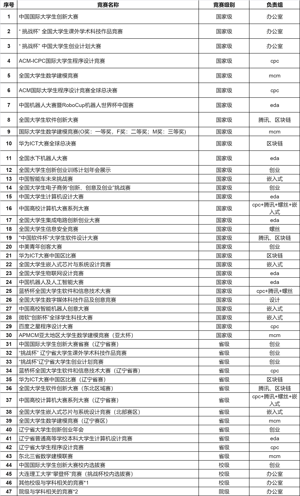

# 创新创业奖荣誉评选（比赛部分）认定清单竞赛简介

## 一、任务划分



## 二、文件职责说明

* **国家级比赛简介**统一撰写在
  `nationalLevel.md`

* **省级比赛简介**统一撰写在
  `provincialLevel.md`

* **校级比赛简介**统一撰写在
  `schoolLevel.md`

请勿在上述文件之外新增同级比赛简介文件。


## 三、比赛图片规范

### 1. 图片存放位置

* 所有比赛相关图片统一存放在 `img/` 目录下
* 每个比赛需单独建立一个文件夹
* 文件夹名称为 **比赛英文名（或通用英文简称）**

示例：

```txt
img/ICPC/
img/CCPC/
```

### 2. 图片命名规则

* 图片名称需能反映图片内容
* 统一采用 **驼峰命名法（CamelCase）**

示例：

```txt
img/ICPC/naiLong.jpg
img/CCCC/xiYangYang.jpg
```

### 3. 图片大小限制

* 单张图片大小不得超过 **10MB**
* 如图片过大，请进行压缩后再提交


## 四、比赛简介内容规范

比赛简介可包括但不限于以下内容：

* 比赛简介
* 比赛时间
* 官网链接
* 难度（1–5 星）
* 参赛门槛
* 技术关键字（Tag）
* 配图
* 历届情况
* 适合人群
* 加分点

可根据比赛实际情况选择合适的条目撰写，不做强制要求。


## 五、Markdown 撰写规范

### 1. 标题层级

* **比赛标题**：使用 `#` 一级标题
* **比赛下的子赛道 / 分组 / 方向**：使用 `##` 二级标题

示例：

```md
# 国际大学生程序设计竞赛（ICPC）

## 区域赛（Regional Contest）

## 世界总决赛（World Finals）
```

### 2. Markdown 使用原则

* 不要使用过于高级或复杂的 Markdown 语法
* 避免嵌套过深的列表
* 图片使用相对路径引用

示例：

```md

```


## 六、Commit 提交规范

提交代码时，请尽可能遵循以下 Commit Message 规范：

| 类型          | 说明                               |
| ------------- | ---------------------------------- |
| **feat:**     | 新增比赛文档                       |
| **fix:**      | 修正文档错误（时间、链接、格式等） |
| **docs:**     | 非比赛内容文档更新                 |
| **refactor:** | 重构目录结构 / 模板，不改变内容    |
| **perf:**     | 性能或体积优化（如图片压缩）       |
| **chore:**    | 常规维护、配置调整                 |

### Commit 示例

```
feat: add ICPC competition introduction
fix: correct official link in CCPC section
perf: compress ICPC images
```


## 七、仓库目录结构

```txt
.
├── README.md                  # 仓库说明
├── nationalLevel.md           # 国家级比赛汇总
├── provincialLevel.md         # 省级比赛汇总
├── schoolLevel.md             # 校级比赛汇总
└── img/                       # 各类比赛的配图资源
    ├── CCPC/                  # CCPC 专属图片
    │   ├── keAiMaoNiang.jpeg
    │   └── naiLong.jpg
    └── ICPC/                  # ICPC 专属图片
        └── (放置对应图片...)
```


大家合作愉快喵~

